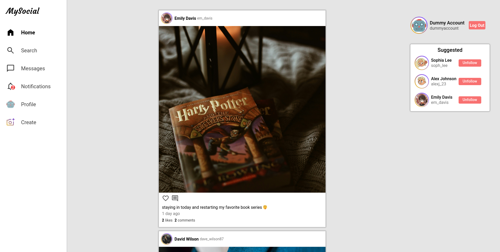
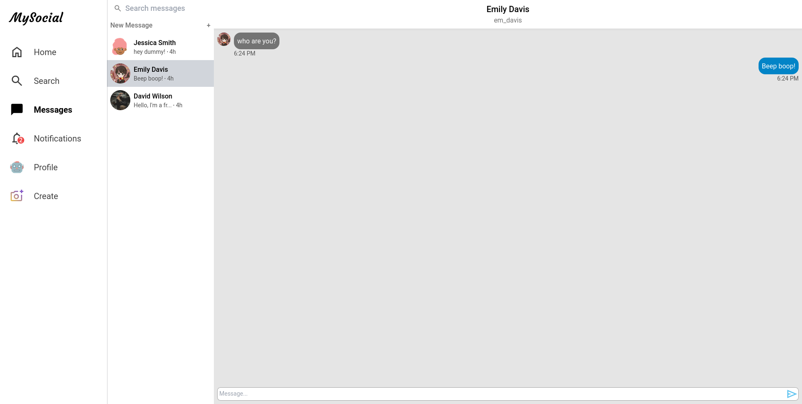

<h1 align="center">MySocial</h1>
<h2>About</h2>

MySocial is a social media platform project based off of Instagram and Twitter (now <b>X</b>). It has a functional and easy to use interface for the frontend that is supported by a custom made REST API backend.

<h2>Features</h2>
<ul>
    <li><b>Create, Edit, and Delete Posts:</b> Share your thoughts and images with ease.</li>
    <li><b>Personalized Home Feed:</b> Stay updated with recent posts from followed users and featured content.</li>
    <li><b>Search Functionality:</b> Easily find users and posts through the search feature.</li>
    <li><b>Follow Users:</b> Stay connected with friends and other users.</li>
    <li><b>Real-time messaging:</b> Chat with friends and other users instantly and in real-time.</li>
    <li><b>Notification system:</b> Stay informed with the instantaneous notification system.</li>
</ul>
<h3>Made with</h3>
<ul>
    <li>React (TypeScript)</li>
    <li>Tailwind CSS</li>
    <li>Express</li>
    <li>MongoDB</li>
</ul>
<h2>Screenshots</h2>
</img>
</img>
